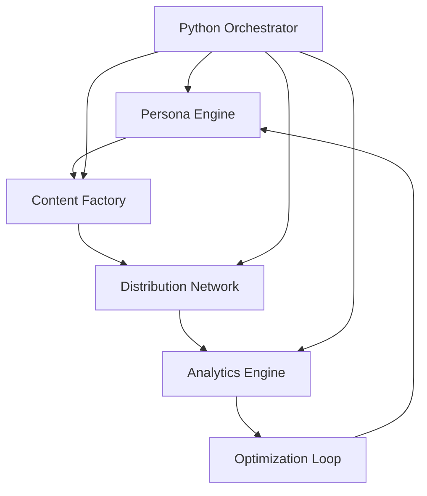

# AI-Automated Viral Content System PRP
## Product Requirements & Implementation Guide

---

## Executive Summary

This document outlines the complete system architecture and implementation strategy for an **AI-automated viral content generation and distribution platform**. The system leverages cutting-edge AI technologies (NanoBanana, VEO3) to automate the entire content creation pipeline from persona generation to multi-platform distribution, implementing the proven "$5M ARR growth playbook" through AI automation.

**Core Innovation**: Replace human creators with AI personas that generate viral content at scale, eliminating the $4,000/month creator costs while achieving infinite scalability.

---

## Table of Contents
1. [System Overview](#system-overview)
2. [Technical Architecture](#technical-architecture)
3. [Growth Methodology](#growth-methodology)
4. [Implementation Phases](#implementation-phases)
5. [Code Implementation](#code-implementation)
6. [Best Practices](#best-practices)
7. [Scaling Strategy](#scaling-strategy)

---

## System Overview

### Core Concept
Transform the manual viral content playbook into a fully automated AI system:
- **AI Personas** instead of human creators
- **Automated content generation** using NanoBanana/VEO3
- **Viral series replication** at scale
- **Multi-account orchestration** across platforms
- **Data-driven optimization** loops

### Key Metrics & Goals
- **Target**: Profitable CAC with 3x LTV:CAC ratio
- **Payback Period**: <3 months
- **Initial Scale**: 5-10 AI personas
- **Content Output**: 20+ videos/day per persona
- **Platform Coverage**: TikTok, Instagram Reels, YouTube Shorts

---

## Technical Architecture

### System Components



### 1. Persona Engine
**Purpose**: Generate and manage consistent AI personalities

**Technologies**:
- **NanoBanana** (Gemini 2.5 Flash) for face generation
- **Voice Synthesis** (ElevenLabs/PlayHT)
- **Personality Templates** (JSON configurations)

**Key Features**:
- Consistent face across videos
- Unique voice signatures
- Personality traits & content styles
- Audience targeting profiles

### 2. Content Factory
**Purpose**: Generate viral video content at scale

**Technologies**:
- **VEO3** for 8-second video generation (720p/1080p)
- **NanoBanana** for image sequences
- **AI Script Generation** (GPT-4/Claude)

**Viral Series Framework**:
```json
{
  "series_type": "POV_format",
  "template": "POV: {{scenario}}",
  "variations": [
    "You have an essay due {{time_context}}",
    "Your code has a bug {{urgency_level}}",
    "The client wants changes {{deadline_pressure}}"
  ],
  "call_to_action": "Use {{product}} to {{benefit}}"
}
```

### 3. Distribution Network
**Purpose**: Multi-platform posting with anti-detection

**Key Components**:
- **API Integration** (TikTok, Instagram, YouTube)
- **Anti-Detection Layer** (fingerprint spoofing)
- **Posting Scheduler** (optimal timing)
- **Account Manager** (credential rotation)

### 4. Analytics Engine
**Purpose**: Track performance and identify winners

**Metrics Tracked**:
- View count & velocity
- Engagement rate (likes, comments, shares)
- Completion rate
- Conversion metrics
- Platform-specific signals

### 5. Optimization Loop
**Purpose**: Continuous improvement through data

**Process**:
1. Identify high-performing content
2. Extract winning patterns
3. Generate variations
4. A/B test systematically
5. Scale winners, kill losers

---

## Growth Methodology

### The Viral Content Formula

Based on research and the $5M ARR playbook:

1. **Hook Engineering** (0-3 seconds)
   - Pattern interrupts
   - Curiosity gaps
   - Emotional triggers
   - Visual surprises

2. **Engagement Patterns**
   - Story arc in 8 seconds
   - Multiple watch triggers
   - Comment bait elements
   - Share-worthy moments

3. **Series Multiplication**
   ```python
   # Viral Series Generator
   import random

   class ViralSeriesGenerator:
       def __init__(self, base_template):
           self.template = base_template
           self.variations = []

       def generate_variation(self, params):
           variation = {
               'hook': self.mutate_hook(params['context']),
               'content': self.template['core'],
               'cta': self.adapt_cta(params['product'])
           }
           return variation

       def mutate_hook(self, context):
           hooks = [
               f"POV: {context['scenario']}",
               "Nobody talks about this...",
               f"I tried {context['competitor']} vs {context['product']}",
               f"The {context['industry']} doesn't want you to know..."
           ]
           return random.choice(hooks)
   ```

### Algorithm Optimization

#### TikTok Algorithm Factors (2025)
1. **Completion Rate** (most important)
2. **Engagement Velocity** (first hour)
3. **Share Rate** (viral indicator)
4. **Profile Visits** (interest signal)
5. **Sound Usage** (trending audio boost)

#### Instagram Reels Factors
1. **Watch Time** (% watched)
2. **Saves** (high-value engagement)
3. **Shares to Stories** (amplification)
4. **Audio Adoption** (using your audio)

#### YouTube Shorts Factors
1. **Average View Duration**
2. **Click-Through Rate**
3. **Engagement Rate**
4. **Session Duration** (keeping users on platform)

---

## Implementation Phases

### Phase 1: MVP Core Engine (Weeks 1-2)

**Deliverables**:
- Single AI persona generation
- Basic video creation pipeline
- Manual posting to one platform
- Simple analytics tracking

**Tech Stack**:
```python
# Core Dependencies (requirements.txt)
google-generativeai==0.8.0     # NanoBanana/VEO3 integration
asynci==3.4.3                  # Async operations
aiohttp==3.9.5                 # Async HTTP requests
playwright==1.45.0             # Browser automation
redis==5.0.0                   # Queue and caching
celery==5.4.0                  # Task orchestration
sqlalchemy==2.0.0              # Database ORM
fastapi==0.110.0               # API framework
uvicorn==0.30.0                # ASGI server
pandas==2.2.0                  # Data analysis
numpy==1.26.0                  # Numerical operations
schedule==1.2.0                # Job scheduling
python-dotenv==1.0.0           # Environment management
```

### Phase 2: Multi-Account Scaling (Weeks 3-4)

**Deliverables**:
- 5 AI personas active
- Automated posting across platforms
- Anti-detection implementation
- Viral series templates

**Account Management Strategy**:
```python
import uuid
from typing import Dict, List, Optional

class AccountManager:
    def __init__(self):
        self.accounts: Dict[str, dict] = {}
        self.proxies: List[str] = []
        self.fingerprints: List[dict] = []
        self.current_index = 0

    def create_account(self, platform: str, persona: dict) -> dict:
        account = {
            'id': str(uuid.uuid4()),
            'platform': platform,
            'persona': persona,
            'proxy': self.assign_proxy(),
            'fingerprint': self.generate_fingerprint(),
            'cookies': {},
            'status': 'active',
            'metrics': {
                'posts': 0,
                'views': 0,
                'engagement': 0
            }
        }

        self.accounts[account['id']] = account
        return account

    def rotate_accounts(self) -> Optional[dict]:
        """Implement round-robin posting"""
        active_accounts = [
            acc for acc in self.accounts.values()
            if acc['status'] == 'active'
        ]

        if not active_accounts:
            return None

        account = active_accounts[self.current_index % len(active_accounts)]
        self.current_index += 1
        return account
```

### Phase 3: Intelligence Layer (Weeks 5-6)

**Deliverables**:
- Performance analytics dashboard
- Automated A/B testing
- Content optimization AI
- Trend detection system

### Phase 4: SaaS Transformation (Weeks 7-8)

**Deliverables**:
- Multi-tenant architecture
- User dashboard
- Billing integration
- API documentation

---

## Code Implementation

### 1. AI Video Generator Wrapper

```javascript
// ai-generator.js
const { GoogleGenerativeAI } = require("@google/generative-ai");

class AIVideoGenerator {
  constructor(apiKey) {
    this.genAI = new GoogleGenerativeAI(apiKey);
    this.veo3Model = null;
    this.nanoBananaModel = null;
  }

  async initialize() {
    // Initialize VEO3 for video generation
    this.veo3Model = this.genAI.getGenerativeModel({
      model: "veo-3",
      generationConfig: {
        videoDuration: 8,
        resolution: "1080p",
        fps: 30
      }
    });

    // Initialize NanoBanana for images
    this.nanoBananaModel = this.genAI.getGenerativeModel({
      model: "gemini-2.5-flash",
      generationConfig: {
        imageGeneration: true
      }
    });
  }

  async generateVideo(prompt, persona) {
    try {
      // Generate video with VEO3
      const videoPrompt = `
        Create an 8-second video featuring ${persona.description}.
        Style: ${persona.style}
        Scene: ${prompt}
        Include: Natural movements, realistic lighting, high engagement
        Audio: Include ambient sounds and voice if speaking
      `;

      const result = await this.veo3Model.generateContent(videoPrompt);

      return {
        videoUrl: result.response.videoUrl,
        duration: 8,
        resolution: "1080p",
        metadata: {
          persona: persona.id,
          prompt: prompt,
          timestamp: new Date().toISOString()
        }
      };
    } catch (error) {
      console.error("Video generation failed:", error);
      throw error;
    }
  }

  async generatePersonaFace(description) {
    const imagePrompt = `
      Professional headshot photo of ${description}.
      Style: Realistic, high quality, consistent lighting
      Background: Neutral, professional
      Expression: Friendly, approachable
    `;

    const result = await this.nanoBananaModel.generateContent(imagePrompt);
    return result.response.imageUrl;
  }

  async createViralSeries(template, variations = 10) {
    const videos = [];

    for (let i = 0; i < variations; i++) {
      const variation = this.mutateTemplate(template, i);
      const video = await this.generateVideo(
        variation.prompt,
        variation.persona
      );
      videos.push(video);

      // Rate limiting
      await this.delay(2000);
    }

    return videos;
  }

  mutateTemplate(template, index) {
    // Implement template mutation logic
    const scenarios = template.scenarios || [];
    const scenario = scenarios[index % scenarios.length];

    return {
      prompt: template.basePrompt.replace('{{scenario}}', scenario),
      persona: template.persona
    };
  }

  delay(ms) {
    return new Promise(resolve => setTimeout(resolve, ms));
  }
}

module.exports = AIVideoGenerator;
```

### 2. Multi-Platform Distributor

```javascript
// distributor.js
const TikTokAPI = require('tiktok-api');
const InstagramAPI = require('instagram-private-api');
const YouTubeAPI = require('youtube-api');

class MultiPlatformDistributor {
  constructor(config) {
    this.platforms = {
      tiktok: new TikTokAPI(config.tiktok),
      instagram: new InstagramAPI.IgApiClient(),
      youtube: new YouTubeAPI(config.youtube)
    };

    this.postingSchedule = config.schedule || {
      tiktok: ['09:00', '14:00', '19:00', '22:00'],
      instagram: ['10:00', '15:00', '20:00'],
      youtube: ['11:00', '16:00', '21:00']
    };
  }

  async distributeVideo(video, metadata) {
    const results = {
      tiktok: null,
      instagram: null,
      youtube: null
    };

    // Post to TikTok
    if (this.shouldPostNow('tiktok')) {
      results.tiktok = await this.postToTikTok(video, metadata);
    }

    // Post to Instagram Reels
    if (this.shouldPostNow('instagram')) {
      results.instagram = await this.postToInstagram(video, metadata);
    }

    // Post to YouTube Shorts
    if (this.shouldPostNow('youtube')) {
      results.youtube = await this.postToYouTube(video, metadata);
    }

    return results;
  }

  async postToTikTok(video, metadata) {
    try {
      const caption = this.generateCaption(metadata, 'tiktok');
      const hashtags = this.generateHashtags(metadata, 'tiktok');

      const response = await this.platforms.tiktok.upload({
        video: video.url,
        caption: `${caption} ${hashtags}`,
        privacy: 'public',
        duet: true,
        stitch: true
      });

      return {
        platform: 'tiktok',
        postId: response.id,
        url: response.url,
        timestamp: new Date().toISOString()
      };
    } catch (error) {
      console.error('TikTok posting failed:', error);
      return { error: error.message };
    }
  }

  async postToInstagram(video, metadata) {
    // Instagram Reels implementation
    const caption = this.generateCaption(metadata, 'instagram');
    const hashtags = this.generateHashtags(metadata, 'instagram', 30);

    // Configure and post
    await this.platforms.instagram.account.login(
      process.env.INSTAGRAM_USERNAME,
      process.env.INSTAGRAM_PASSWORD
    );

    const reel = await this.platforms.instagram.publish.video({
      video: video.url,
      caption: `${caption}\n.\n.\n.\n${hashtags}`,
      isReel: true
    });

    return {
      platform: 'instagram',
      postId: reel.media.id,
      url: `https://instagram.com/reel/${reel.media.code}`,
      timestamp: new Date().toISOString()
    };
  }

  async postToYouTube(video, metadata) {
    // YouTube Shorts implementation
    const title = this.generateTitle(metadata, 'youtube');
    const description = this.generateDescription(metadata, 'youtube');
    const tags = this.generateTags(metadata, 'youtube');

    const response = await this.platforms.youtube.videos.insert({
      part: 'snippet,status',
      requestBody: {
        snippet: {
          title: `${title} #Shorts`,
          description,
          tags,
          categoryId: '22' // People & Blogs
        },
        status: {
          privacyStatus: 'public',
          selfDeclaredMadeForKids: false
        }
      },
      media: {
        body: video.stream
      }
    });

    return {
      platform: 'youtube',
      postId: response.data.id,
      url: `https://youtube.com/shorts/${response.data.id}`,
      timestamp: new Date().toISOString()
    };
  }

  generateCaption(metadata, platform) {
    const templates = {
      tiktok: [
        `POV: ${metadata.scenario} 🎬`,
        `Wait for it... ${metadata.hook} 😱`,
        `Nobody talks about this ${metadata.topic} hack 🤯`
      ],
      instagram: [
        `${metadata.hook}\n\n${metadata.scenario}`,
        `Save this for later! 📌\n\n${metadata.content}`
      ],
      youtube: [
        `${metadata.hook} - ${metadata.topic}`
      ]
    };

    const platformTemplates = templates[platform];
    return platformTemplates[Math.floor(Math.random() * platformTemplates.length)];
  }

  generateHashtags(metadata, platform, limit = 100) {
    const trending = this.getTrendingHashtags(platform);
    const niche = this.getNicheHashtags(metadata.topic);
    const branded = ['#' + metadata.brand];

    const allHashtags = [...trending, ...niche, ...branded];

    // Platform-specific limits
    const maxHashtags = {
      tiktok: 100,
      instagram: 30,
      youtube: 15
    };

    return allHashtags
      .slice(0, Math.min(limit, maxHashtags[platform]))
      .join(' ');
  }

  shouldPostNow(platform) {
    const now = new Date();
    const currentTime = `${now.getHours().toString().padStart(2, '0')}:${now.getMinutes().toString().padStart(2, '0')}`;
    const schedule = this.postingSchedule[platform];

    return schedule.some(time => {
      const [hour, minute] = time.split(':');
      return now.getHours() === parseInt(hour) &&
             Math.abs(now.getMinutes() - parseInt(minute)) < 5;
    });
  }

  getTrendingHashtags(platform) {
    // In production, fetch from trending API
    const trending = {
      tiktok: ['#fyp', '#foryou', '#viral', '#trending', '#foryoupage'],
      instagram: ['#reels', '#explore', '#viral', '#trending', '#instagood'],
      youtube: ['#shorts', '#youtubeshorts', '#viral', '#trending']
    };

    return trending[platform] || [];
  }

  getNicheHashtags(topic) {
    // Topic-specific hashtags
    const topicHashtags = {
      'ai': ['#artificialintelligence', '#ai', '#machinelearning', '#tech', '#automation'],
      'productivity': ['#productivity', '#efficiency', '#lifehacks', '#timemanagement'],
      'education': ['#education', '#learning', '#students', '#study', '#edtech']
    };

    return topicHashtags[topic] || ['#content', '#video'];
  }
}

module.exports = MultiPlatformDistributor;
```

### 3. Analytics & Optimization Engine

```javascript
// analytics.js
class AnalyticsEngine {
  constructor() {
    this.metrics = new Map();
    this.winners = [];
    this.optimizationQueue = [];
  }

  async trackVideo(videoId, platform, initialMetrics) {
    const tracking = {
      videoId,
      platform,
      timestamp: Date.now(),
      metrics: {
        views: 0,
        likes: 0,
        comments: 0,
        shares: 0,
        completionRate: 0,
        engagementRate: 0,
        ...initialMetrics
      },
      history: []
    };

    this.metrics.set(`${platform}:${videoId}`, tracking);

    // Schedule periodic checks
    this.scheduleMetricUpdates(videoId, platform);

    return tracking;
  }

  async updateMetrics(videoId, platform) {
    const key = `${platform}:${videoId}`;
    const tracking = this.metrics.get(key);

    if (!tracking) return;

    // Fetch latest metrics from platform
    const newMetrics = await this.fetchPlatformMetrics(videoId, platform);

    // Calculate rates and velocities
    const timeDelta = (Date.now() - tracking.timestamp) / 1000 / 60; // minutes
    const viewVelocity = (newMetrics.views - tracking.metrics.views) / timeDelta;

    // Update tracking
    tracking.history.push({
      timestamp: Date.now(),
      metrics: { ...tracking.metrics }
    });

    tracking.metrics = {
      ...newMetrics,
      viewVelocity,
      engagementRate: this.calculateEngagementRate(newMetrics),
      viralScore: this.calculateViralScore(newMetrics, viewVelocity)
    };

    // Check if winner
    if (tracking.metrics.viralScore > 80) {
      this.markAsWinner(tracking);
    }

    this.metrics.set(key, tracking);
    return tracking;
  }

  calculateEngagementRate(metrics) {
    if (metrics.views === 0) return 0;

    const engagements = metrics.likes + metrics.comments + metrics.shares;
    return (engagements / metrics.views) * 100;
  }

  calculateViralScore(metrics, velocity) {
    // Weighted scoring algorithm
    const weights = {
      completionRate: 0.3,
      engagementRate: 0.25,
      shareRate: 0.25,
      velocity: 0.2
    };

    const shareRate = metrics.views > 0 ? (metrics.shares / metrics.views) * 100 : 0;

    const normalizedScores = {
      completionRate: Math.min(metrics.completionRate / 80 * 100, 100),
      engagementRate: Math.min(metrics.engagementRate / 10 * 100, 100),
      shareRate: Math.min(shareRate / 2 * 100, 100),
      velocity: Math.min(velocity / 1000 * 100, 100)
    };

    const viralScore = Object.keys(weights).reduce((score, key) => {
      return score + (normalizedScores[key] * weights[key]);
    }, 0);

    return Math.round(viralScore);
  }

  markAsWinner(tracking) {
    this.winners.push({
      ...tracking,
      markedAt: Date.now()
    });

    // Queue for optimization
    this.optimizationQueue.push({
      type: 'replicate',
      source: tracking,
      priority: tracking.metrics.viralScore
    });

    console.log(`🎯 Winner detected: ${tracking.platform}:${tracking.videoId} with viral score ${tracking.metrics.viralScore}`);
  }

  async getOptimizationSuggestions() {
    // Analyze winners for patterns
    const patterns = this.analyzeWinningPatterns();

    return {
      topHooks: patterns.hooks,
      optimalLength: patterns.avgDuration,
      bestPostingTimes: patterns.postingTimes,
      winningTopics: patterns.topics,
      recommendations: this.generateRecommendations(patterns)
    };
  }

  analyzeWinningPatterns() {
    const patterns = {
      hooks: [],
      avgDuration: 0,
      postingTimes: [],
      topics: []
    };

    this.winners.forEach(winner => {
      // Extract patterns from winning content
      // This would analyze the actual content metadata
    });

    return patterns;
  }

  generateRecommendations(patterns) {
    const recommendations = [];

    // Generate specific recommendations based on patterns
    if (patterns.hooks.length > 0) {
      recommendations.push({
        type: 'hook',
        action: 'replicate',
        details: `Top performing hook: "${patterns.hooks[0]}"`,
        priority: 'high'
      });
    }

    if (patterns.avgDuration) {
      recommendations.push({
        type: 'duration',
        action: 'adjust',
        details: `Optimal video length: ${patterns.avgDuration} seconds`,
        priority: 'medium'
      });
    }

    return recommendations;
  }

  async fetchPlatformMetrics(videoId, platform) {
    // Platform-specific API calls
    switch(platform) {
      case 'tiktok':
        return this.fetchTikTokMetrics(videoId);
      case 'instagram':
        return this.fetchInstagramMetrics(videoId);
      case 'youtube':
        return this.fetchYouTubeMetrics(videoId);
      default:
        throw new Error(`Unknown platform: ${platform}`);
    }
  }

  scheduleMetricUpdates(videoId, platform) {
    // Check frequently in first hour (viral window)
    const checkIntervals = [
      5 * 60 * 1000,    // 5 minutes
      15 * 60 * 1000,   // 15 minutes
      30 * 60 * 1000,   // 30 minutes
      60 * 60 * 1000,   // 1 hour
      3 * 60 * 60 * 1000, // 3 hours
      6 * 60 * 60 * 1000, // 6 hours
      24 * 60 * 60 * 1000 // 24 hours
    ];

    checkIntervals.forEach((interval, index) => {
      setTimeout(async () => {
        await this.updateMetrics(videoId, platform);

        // If going viral, increase check frequency
        const tracking = this.metrics.get(`${platform}:${videoId}`);
        if (tracking && tracking.metrics.viralScore > 70 && index < 3) {
          this.scheduleMetricUpdates(videoId, platform);
        }
      }, interval);
    });
  }

  // Placeholder methods for platform-specific metric fetching
  async fetchTikTokMetrics(videoId) {
    // Would use TikTok API or scraping
    return {
      views: Math.floor(Math.random() * 10000),
      likes: Math.floor(Math.random() * 1000),
      comments: Math.floor(Math.random() * 100),
      shares: Math.floor(Math.random() * 50),
      completionRate: Math.random() * 100
    };
  }

  async fetchInstagramMetrics(videoId) {
    // Would use Instagram API
    return {
      views: Math.floor(Math.random() * 8000),
      likes: Math.floor(Math.random() * 800),
      comments: Math.floor(Math.random() * 80),
      shares: Math.floor(Math.random() * 40),
      saves: Math.floor(Math.random() * 60),
      completionRate: Math.random() * 100
    };
  }

  async fetchYouTubeMetrics(videoId) {
    // Would use YouTube API
    return {
      views: Math.floor(Math.random() * 5000),
      likes: Math.floor(Math.random() * 500),
      comments: Math.floor(Math.random() * 50),
      shares: Math.floor(Math.random() * 25),
      completionRate: Math.random() * 100,
      avgViewDuration: Math.random() * 8
    };
  }
}

module.exports = AnalyticsEngine;
```

### 4. Temporal Workflow Orchestration

```typescript
// orchestrator.ts - Main Temporal Workflow
import { proxyActivities, sleep, defineSignal, defineQuery, setHandler } from '@temporalio/workflow';
import type * as activities from './activities';

// Proxy all activities for fault tolerance
const {
  generatePersona,
  generateVideo,
  distributeToP platforms,
  trackAnalytics,
  replicateWinner,
  updateMetrics
} = proxyActivities<typeof activities>({
  startToCloseTimeout: '10 minutes',
  retry: {
    initialInterval: '30s',
    backoffCoefficient: 2,
    maximumAttempts: 5
  }
});

// Define signals for dynamic control
export const pauseWorkflow = defineSignal('pauseWorkflow');
export const resumeWorkflow = defineSignal('resumeWorkflow');
export const scaleUp = defineSignal<[number]>('scaleUp');

// Define queries for monitoring
export const getStatus = defineQuery<WorkflowStatus>('getStatus');
export const getMetrics = defineQuery<WorkflowMetrics>('getMetrics');

interface WorkflowInput {
  personas: PersonaConfig[];
  templates: ViralTemplate[];
  platforms: Platform[];
  batchSize: number;
}

export async function viralContentPipeline(input: WorkflowInput): Promise<WorkflowResult> {
  let isPaused = false;
  let currentScale = input.batchSize;
  const metrics: WorkflowMetrics = {
    videosGenerated: 0,
    videosDistributed: 0,
    winnersFound: 0,
    totalViews: 0,
    viralScore: 0
  };

  // Set up signal handlers
  setHandler(pauseWorkflow, () => { isPaused = true; });
  setHandler(resumeWorkflow, () => { isPaused = false; });
  setHandler(scaleUp, (newScale: number) => { currentScale = newScale; });

  // Set up query handlers
  setHandler(getStatus, () => ({ isPaused, currentScale, ...metrics }));
  setHandler(getMetrics, () => metrics);

  while (true) {
    // Check if paused
    while (isPaused) {
      await sleep('10s');
    }
    // Generate content variations in parallel batches
    const variations = [];
    for (const persona of input.personas) {
      for (const template of input.templates) {
        variations.push({ persona, template });
      }
    }

    // Process in parallel batches for efficiency
    const batches = chunk(variations, currentScale);

    for (const batch of batches) {
      const videoPromises = batch.map(async (variation) => {
        try {
          // Generate AI video with automatic retry
          const video = await generateVideo({
            persona: variation.persona,
            template: variation.template,
            timestamp: Date.now()
          });

          metrics.videosGenerated++;
          return video;
        } catch (error) {
          console.error(`Failed to generate video: ${error}`);
          return null;
        }
      });

      const videos = await Promise.all(videoPromises);
      const validVideos = videos.filter(v => v !== null);
      // Distribute videos to platforms in parallel
      const distributionPromises = validVideos.map(async (video) => {
        const results = await distributeToP platforms({
          video,
          platforms: input.platforms,
          optimizeForTime: true
        });

        metrics.videosDistributed++;
        return results;
      });

      const distributionResults = await Promise.all(distributionPromises);
      // Track analytics for all distributed content
      const analyticsPromises = distributionResults.flat().map(async (result) => {
        if (result.success) {
          const analytics = await trackAnalytics({
            postId: result.postId,
            platform: result.platform,
            initialMetrics: result.metrics
          });

          metrics.totalViews += analytics.views;

          // Check for viral winners
          if (analytics.viralScore > 70) {
            metrics.winnersFound++;
            metrics.viralScore = Math.max(metrics.viralScore, analytics.viralScore);

            // Replicate winners automatically
            await replicateWinner({
              videoId: result.videoId,
              variations: 10,
              priority: 'high'
            });
          }

          return analytics;
        }
      });

      await Promise.all(analyticsPromises);
    }

    // Update metrics to external monitoring
    await updateMetrics(metrics);

    // Sleep for 3 hours before next batch
    await sleep('3h');
  }
}

// Helper function to chunk arrays
function chunk<T>(array: T[], size: number): T[][] {
  const chunks: T[][] = [];
  for (let i = 0; i < array.length; i += size) {
    chunks.push(array.slice(i, i + size));
  }
  return chunks;
}

// Activity implementations
export const activities = {
  async generatePersona(config: PersonaConfig): Promise<Persona> {
    // Implementation using NanoBanana API
    const response = await fetch('https://api.google.com/nanobana/generate', {
      method: 'POST',
      headers: { 'Authorization': `Bearer ${process.env.GOOGLE_AI_API_KEY}` },
      body: JSON.stringify({
        prompt: config.description,
        style: config.style
      })
    });
    return response.json();
  },

  async generateVideo(params: VideoParams): Promise<Video> {
    // Implementation using VEO3 API
    const response = await fetch('https://api.google.com/veo3/generate', {
      method: 'POST',
      headers: { 'Authorization': `Bearer ${process.env.VEO3_API_KEY}` },
      body: JSON.stringify({
        persona: params.persona,
        template: params.template,
        duration: 8,
        resolution: '1080p'
      })
    });
    return response.json();
  },

  async distributeToP platforms(params: DistributionParams): Promise<DistributionResult[]> {
    // Implementation for multi-platform distribution
    const results = [];
    for (const platform of params.platforms) {
      const result = await distributeToPlatform(params.video, platform);
      results.push(result);
    }
    return results;
  },

  async trackAnalytics(params: AnalyticsParams): Promise<Analytics> {
    // Implementation for tracking metrics
    // This would connect to your analytics service
    return fetchAnalytics(params.postId, params.platform);
  },

  async replicateWinner(params: ReplicationParams): Promise<void> {
    // Implementation for replicating viral content
    // This triggers new video generation based on winning template
    await createVariations(params.videoId, params.variations);
  }
};
```

---

## Best Practices

### 1. Content Creation Best Practices

**Hook Optimization**:
- First 3 seconds determine 90% of success
- Use pattern interrupts and curiosity gaps
- Test multiple hook variations per concept

**Viral Series Development**:
- Find one winner, create 100 variations
- Maintain core structure, vary surface elements
- Track which variations perform best

### 2. Multi-Account Management

**Anti-Detection Strategies**:
- Unique device fingerprints per account
- Residential proxy rotation
- Human-like posting patterns
- Gradual account warming

**Account Scaling**:
```javascript
// Account warming schedule
const warmingSchedule = [
  { day: 1, posts: 1, engagement: 'view_only' },
  { day: 2, posts: 1, engagement: 'like_few' },
  { day: 3, posts: 2, engagement: 'like_comment' },
  { day: 7, posts: 3, engagement: 'full' },
  { day: 14, posts: 5, engagement: 'full' },
  { day: 30, posts: 10, engagement: 'full' }
];
```

### 3. Platform-Specific Optimization

**TikTok**:
- Post 3-5 times daily
- Use trending sounds
- Engage with comments immediately
- Optimal times: 9am, 2pm, 7pm, 10pm

**Instagram Reels**:
- Post 1-3 times daily
- Hide hashtags in comments
- Use location tags
- Cross-promote to Stories

**YouTube Shorts**:
- Post 1-2 times daily
- Optimize thumbnail selection
- Use detailed descriptions
- Link to longer content

### 4. Data-Driven Optimization

**Key Metrics to Track**:
1. **Virality Indicators**:
   - Hour 1 view velocity
   - Share-to-view ratio
   - Comment sentiment

2. **Conversion Metrics**:
   - Profile visit rate
   - Link click rate
   - Conversion rate by source

3. **Content Performance**:
   - Completion rate by second
   - Re-watch rate
   - Audio adoption rate

---

## Scaling Strategy

### Phase-Based Scaling Approach

**Month 1: Foundation**
- 1 persona, 3 platforms
- 10 videos/day
- Manual optimization
- Target: 100k views/day

**Month 2: Expansion**
- 5 personas, 3 platforms
- 50 videos/day
- Semi-automated optimization
- Target: 1M views/day

**Month 3: Acceleration**
- 20 personas, 3 platforms
- 200 videos/day
- Fully automated optimization
- Target: 10M views/day

**Month 4-6: SaaS Transformation**
- Productize the system
- Add user management
- Implement billing
- Launch with case studies

### Cost Structure

**Development Phase**:
- AI API costs: ~$500/month
- Proxy/Anti-detect: ~$200/month
- Server infrastructure: ~$100/month
- Total: ~$800/month

**Scaling Phase**:
- AI API costs: ~$2000/month
- Proxy/Anti-detect: ~$500/month
- Server infrastructure: ~$500/month
- Total: ~$3000/month

**Revenue Model** (SaaS):
- Starter: $297/month (5 personas)
- Growth: $997/month (20 personas)
- Enterprise: $2997/month (unlimited)

---

## Risk Mitigation

### Technical Risks
1. **API Rate Limits**: Implement queuing and backoff strategies
2. **Platform Detection**: Use sophisticated fingerprinting
3. **Content Moderation**: Pre-screen with AI safety checks

### Business Risks
1. **Platform Policy Changes**: Diversify across platforms
2. **Competition**: Focus on execution speed and data
3. **Scaling Issues**: Build modular, cloud-native architecture

---

## Conclusion

This AI-automated viral content system represents a paradigm shift in digital marketing. By combining cutting-edge AI technology with proven growth strategies, we can achieve:

- **Infinite scalability** without human bottlenecks
- **Consistent quality** through AI standardization
- **Data-driven optimization** at unprecedented speed
- **Cost efficiency** compared to traditional methods

The key to success is rapid iteration, data-driven decision making, and relentless focus on viral mechanics. Start small, prove the model, then scale aggressively.

---

## Appendix

### A. Environment Variables
```env
# AI Services
GOOGLE_AI_API_KEY=your_api_key
VEO3_API_KEY=your_veo3_key

# Social Platforms
TIKTOK_API_KEY=your_tiktok_key
INSTAGRAM_USERNAME=your_username
INSTAGRAM_PASSWORD=your_password
YOUTUBE_API_KEY=your_youtube_key

# Infrastructure
TEMPORAL_ADDRESS=localhost:7233
REDIS_URL=redis://localhost:6379
DATABASE_URL=postgresql://localhost/viral

# Anti-Detection
PROXY_PROVIDER_API=your_proxy_api
FINGERPRINT_KEY=your_fingerprint_key
```

### B. Quick Start Commands
```bash
# Install dependencies
npm install

# Initialize database
npm run db:migrate

# Start development server
npm run dev

# Start Temporal server and worker
temporal server start-dev
npm run worker

# Run analytics dashboard
npm run analytics

# Deploy to production
npm run deploy
```

### C. Monitoring & Alerts
Set up monitoring for:
- Video generation success rate
- Posting success rate
- Viral score trends
- API usage and costs
- Platform account health

---

**Document Version**: 1.0
**Last Updated**: September 14, 2025
**Status**: Ready for Implementation

---

Signed off as SmokeDev 🚬