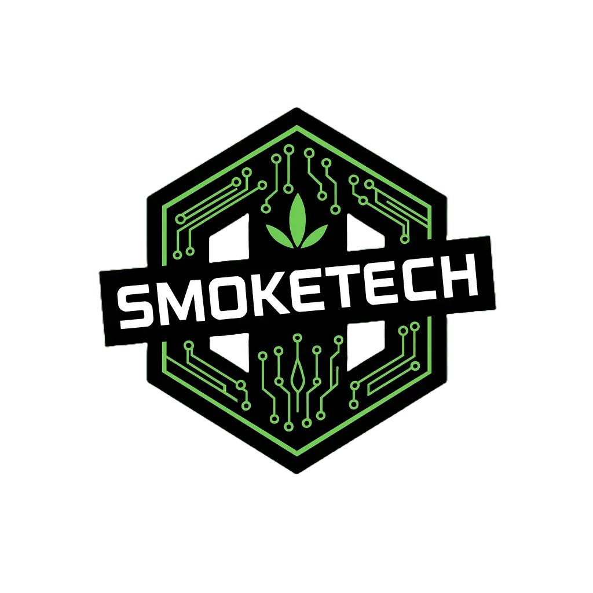

<div align="center">
  

  # SmokeTech Studio

  **Infinite Creation, One Studio**

  Professional AI content generation platform with modular model selection and Omega Workflow integration. Built with Next.js 15 and powered by Imagen 3, Imagen 4, and NanoBanana models.
</div>

## ✨ Features

### 🎨 **Multi-Model Image Generation**
- **Imagen 3** & **Imagen 4** integration for high-quality images
- **NanoBanana** (Gemini 2.5 Flash Image) for rapid generation
- **Modular model selector** with cost estimation
- **4-image grid layout** with professional UI

### 🎬 **Omega Workflow Integration**
- **Viral content generation** with advanced AI pipeline
- **Video generation** through Omega microservice
- **Real-time status tracking** and progress monitoring
- **Professional stitching** and content optimization

### 🚀 **Professional Features**
- **Cost tracking** and usage analytics
- **Microservices architecture** for scalability
- **Real-time generation** with loading states
- **Download and export** capabilities

## 🛠️ Tech Stack

- **Next.js 15** with App Router and Turbopack
- **TypeScript** for type safety
- **Tailwind CSS** for styling
- **ShadCN UI** components
- **Google GenAI SDK** for AI generation
- **Express.js** microservice (Omega Service)
- **Modular architecture** for scalability

## 📋 Prerequisites

- **Node.js 18+** (20+ recommended)
- **npm** package manager
- **Google AI API Key** (free tier available)

## 🚀 Quick Start

### 1. Clone & Install

```bash
git clone https://github.com/SmokeAlot420/SmokeTech-Studio.git
cd SmokeTech-Studio
npm install
```

### 2. Environment Setup

Create `.env`:

```env
GEMINI_API_KEY=your_google_ai_api_key_here
```

**Get your API key:**
1. Visit [Google AI Studio](https://aistudio.google.com/app/apikey)
2. Generate an API key
3. Copy and paste into `.env`

### 3. Start Services

```bash
# Start main application
npm run dev

# Start Omega service (separate terminal)
node omega-service.js
```

Open [http://localhost:7777](http://localhost:7777) to view SmokeTech Studio.

## 🎯 Usage Guide

### **Generating Images**
1. Type your prompt in the input bar
2. Click **"Image"** button or press Enter
3. Watch 4 high-quality images generate in real-time
4. Hover to **Download**, **Expand**, or **Animate with Veo 2**

### **Generating Videos**
1. Type your video prompt
2. Click **"Video"** button
3. Watch videos generate (takes 30-60 seconds)
4. Hover over video row to autoplay both videos

### **Image-to-Video Conversion**
1. Generate or use sample images
2. Hover over any image
3. Click **"Animate with Veo 2"**
4. Watch as image becomes animated video

### **Viewing & Downloading**
1. **Expand** - Click to view in fullscreen lightbox
2. **Download** - Save images/videos locally
3. **Navigation** - Use arrow keys or or scroll in full screen mode

## 🏗️ Project Structure

```
openjourney-app/
├── src/
│   ├── app/
│   │   ├── api/                 # API routes for AI generation
│   │   │   ├── generate-images/ # Imagen 4 integration
│   │   │   ├── generate-videos/ # Veo 3 text-to-video
│   │   │   └── image-to-video/  # Veo 2 image-to-video
│   │   ├── globals.css          # Global styles
│   │   ├── layout.tsx           # Root layout
│   │   └── page.tsx             # Main page component
│   ├── components/
│   │   ├── ui/                  # ShadCN UI components
│   │   ├── prompt-bar.tsx       # Prompt input with logo
│   │   ├── content-grid.tsx     # Generation management
│   │   ├── image-grid.tsx       # 4-image display grid
│   │   ├── video-grid.tsx       # 2x2 video display
│   │   ├── loading-grid.tsx     # Skeleton loading states
│   │   └── lightbox-modal.tsx   # Fullscreen viewer
│   └── lib/
│       └── utils.ts             # Utility functions
├── public/
│   ├── openjourney-logo.svg     # Brand logo
│   ├── sample-images/           # Demo images
│   └── sample-videos/           # Demo videos
├── next.config.js               # Next.js configuration
├── tailwind.config.ts           # Tailwind configuration
└── package.json                 # Dependencies
```

## 🎨 AI Models Used

### **Imagen 4** (Image Generation)
- **Model**: `imagen-3.0-generate-001`
- **Output**: 4 high-quality 1024x1024 images
- **Format**: Base64 encoded PNG

### **Veo 3** (Text-to-Video)
- **Model**: `veo-3`
- **Output**: High quality video generation with audio
- **Duration**: ~3-5 seconds, 720p

### **Veo 2** (Image-to-Video)
- **Model**: `veo-2.0-generate-001` with image input
- **Input**: Base64 image + text prompt
- **Output**: Animated video from static image

## 🔧 Configuration

### **Image Domains** (next.config.js)
```javascript
images: {
  remotePatterns: [
    {
      protocol: 'https',
      hostname: 'picsum.photos', // For placeholder images
    },
  ],
}
```

## 🚀 Deployment

### **Vercel** (Recommended)
```bash
npm run build
npx vercel --prod
```

### **Docker**
```bash
docker build -t openjourney .
docker run -p 3000:3000 openjourney
```

### **Environment Variables**
Make sure to set `GOOGLE_AI_API_KEY` in your deployment platform or you can enter your key in the app.

## 🤝 Contributing

1. Fork the repository
2. Create feature branch: `git checkout -b feature/amazing-feature`
3. Commit changes: `git commit -m 'Add amazing feature'`
4. Push to branch: `git push origin feature/amazing-feature`
5. Open a Pull Request

## 📝 License

This project is licensed under the MIT License - see the [LICENSE](LICENSE) file for details.

## 🙏 Acknowledgments

- **Google Gemini API** for the powerful generation models
- **Next.js** and **Vercel** for the excellent development platform
- **ShadCN** for the professional UI components

---

**SmokeTech Studio** - Professional AI Content Generation

Built by SmokeDev 🚬
